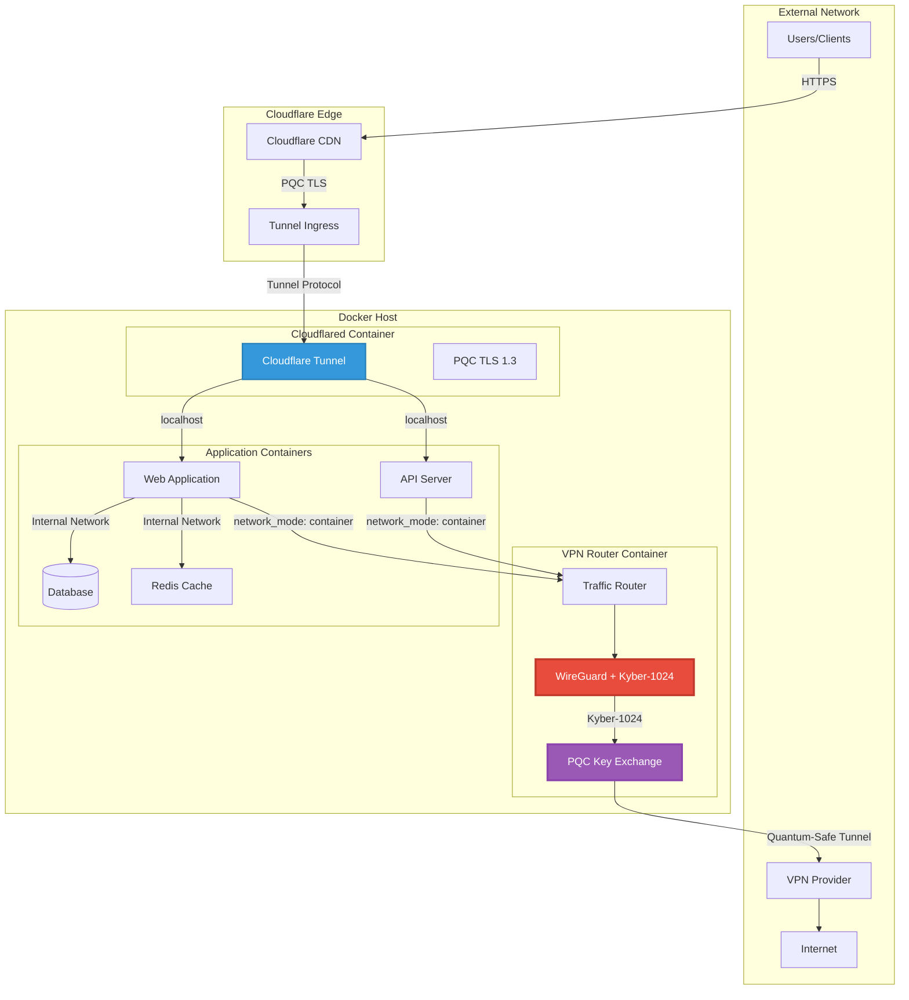
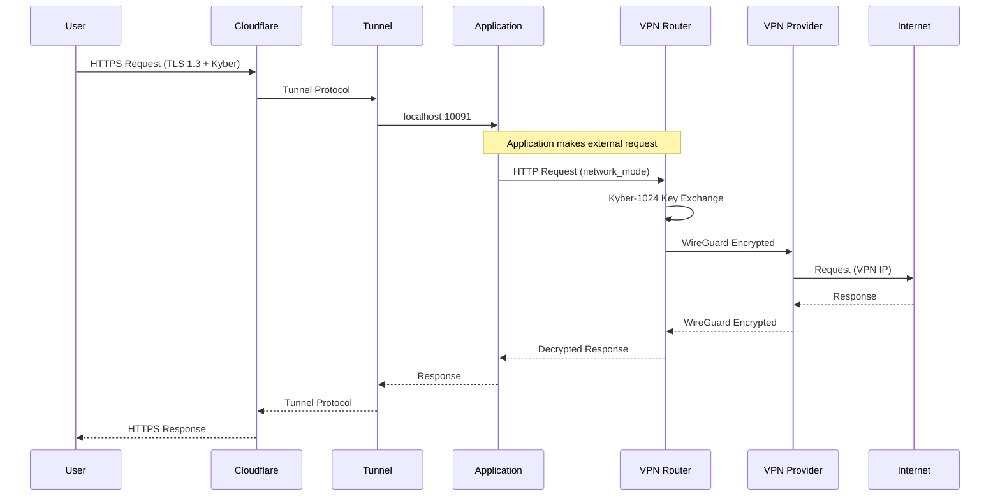

# Abejar Post-Quantum Cryptography VPN Router

<p align="center">
  
</p>

<p align="center">
  <strong>Enterprise-Grade Post-Quantum VPN Routing Infrastructure</strong>
</p>

<p align="center">
  <a href="#features">Features</a> •
  <a href="#quick-start">Quick Start</a> •
  <a href="#architecture">Architecture</a> •
  <a href="#documentation">Docs</a> •
  <a href="#contact">Contact</a>
</p>

<p align="center">
  
  
  
  
</p>

---

## Overview

**Abejar PQC VPN Router (Kyber Native Edition)** is an enterprise-grade VPN routing infrastructure that implements **native Kyber-1024 post-quantum cryptography** directly in the WireGuard protocol. This cutting-edge solution protects your network traffic against both classical and quantum computer attacks.

### Why Post-Quantum Cryptography?

Current encryption standards (RSA, ECDH, ECDSA) are vulnerable to attacks from quantum computers using Shor's algorithm. When large-scale quantum computers become available, they could:

- Break RSA-2048 in hours
- Compromise all ECDH key exchanges
- Decrypt previously captured "harvest now, decrypt later" traffic

**Kyber-1024** is a NIST-standardized post-quantum key encapsulation mechanism that remains secure against quantum attacks while maintaining excellent performance.

---

## Features

### Security
- **Native Kyber-1024 Integration** - Quantum-resistant key exchange at protocol level
- **Hybrid Encryption** - X25519 + Kyber for defense in depth
- **Perfect Forward Secrecy** - Unique session keys for each connection
- **Zero-Trust Architecture** - Localhost-only bindings, no exposed ports

### Performance
- **< 1ms Overhead** - Kyber operations are extremely fast
- **Optimized Routing** - Intelligent traffic management
- **Connection Pooling** - Reduced handshake latency
- **Async I/O** - Non-blocking network operations

### Integration
- **Cloudflare Tunnel Ready** - Secure ingress with PQC TLS
- **Docker Compose** - One-command deployment
- **Any VPN Provider** - Works with any WireGuard-compatible VPN
- **Multi-App Support** - Route multiple applications through single VPN

### Operations
- **Health Monitoring** - Built-in status endpoints
- **Auto-Reconnection** - Resilient VPN connections
- **Log Management** - Structured logging with rotation
- **Metrics Export** - Prometheus-compatible metrics

---

## Quick Start

### Prerequisites

- Docker 24.0+
- Docker Compose 2.20+
- WireGuard VPN credentials from your provider
- (Optional) Cloudflare Tunnel token

### Installation

```bash
# Pull the pre-built image
docker pull ghcr.io/vinzabe/abejar-pqc-kyber:latest

# Clone the configuration
git clone https://github.com/vinzabe/abejar-pqc-vpn-kyber-native.git
cd abejar-pqc-vpn-kyber-native

# Configure environment
cp .env.example .env
nano .env

# Configure WireGuard
cp vpn-router/config/wireguard/wg0.conf.example vpn-router/config/wireguard/wg0.conf
nano vpn-router/config/wireguard/wg0.conf

# Start the VPN router
docker compose up -d

# Verify VPN connection
./scripts/vpn-status.sh
```

### Verify Post-Quantum Security

```bash
# Check Kyber handshake
./scripts/test-pqc-handshake.sh

# Verify outgoing IP (should show VPN IP)
docker exec vpn-router curl -s https://ipinfo.io/ip

# Test routing
./scripts/test-connection.sh
```

---

## Architecture



### Security Layers

```mermaid
graph LR
    subgraph "Layer 1: Edge Security"
        A[Client] -->|TLS 1.3 + PQC| B[Cloudflare]
    end
    
    subgraph "Layer 2: Tunnel Security"
        B -->|Encrypted Tunnel| C[Cloudflared]
    end
    
    subgraph "Layer 3: Container Isolation"
        C -->|Localhost Only| D[Application]
    end
    
    subgraph "Layer 4: VPN Routing"
        D -->|Network Mode| E[VPN Router]
    end
    
    subgraph "Layer 5: Post-Quantum Crypto"
        E -->|Kyber-1024 + X25519| F[WireGuard]
    end
    
    subgraph "Layer 6: VPN Tunnel"
        F -->|Encrypted| G[VPN Provider]
    end
    
    subgraph "Layer 7: Internet Anonymity"
        G -->|VPN IP| H[Internet]
    end
    
    style E fill:#e74c3c,stroke:#c0392b,stroke-width:3px,color:#fff
    style F fill:#9b59b6,stroke:#8e44ad,stroke-width:3px,color:#fff
```



### Traffic Flow



---

## Configuration

### Environment Variables

```bash
# VPN Router Configuration
VPN_INTERFACE=wg0
VPN_CONFIG_PATH=/config/wireguard
VPN_NETWORK_CIDR=172.25.0.0/16
VPN_ROUTER_IP=172.25.0.2

# Post-Quantum Cryptography
PQC_ENABLED=true
PQC_ALGORITHM=kyber1024
PQC_HYBRID_MODE=true  # X25519 + Kyber

# Cloudflare Tunnel
CF_TUNNEL_TOKEN=your-tunnel-token
CF_TUNNEL_PQC=true

# Port Mappings (localhost only)
APP_PORT_START=10091
APP_PORT_END=10100

# Logging
LOG_LEVEL=info
LOG_FORMAT=json
```

### WireGuard Configuration

See [vpn-router/config/wireguard/wg0.conf.example](vpn-router/config/wireguard/wg0.conf.example) for the full template.

Key sections:
- **Interface**: Your VPN credentials
- **Peer**: VPN provider endpoint
- **PostUp/PostDown**: Docker network routing rules (DO NOT MODIFY)

---

## Examples

### SaaS Application

Complete example with FastAPI backend, React frontend, PostgreSQL, and Redis:

```bash
cd examples/saas-application
cp .env.example .env
docker compose up -d
```

See [examples/saas-application/README.md](examples/saas-application/README.md) for details.

### Simple Web App

Basic nginx + PHP application:

```bash
cd examples/simple-web-app
docker compose up -d
```

### Database Application

Application with database on shared network:

```bash
cd examples/database-app
docker compose up -d
```

---

## Documentation

| Document | Description |
|----------|-------------|
| [SECURITY.md](SECURITY.md) | Post-quantum cryptography details and threat model |
| [docs/ARCHITECTURE.md](docs/ARCHITECTURE.md) | System architecture deep dive |
| [docs/INSTALLATION.md](docs/INSTALLATION.md) | Detailed installation guide |
| [docs/CLOUDFLARE_SETUP.md](docs/CLOUDFLARE_SETUP.md) | Cloudflare Tunnel configuration |
| [docs/POST_QUANTUM_CRYPTO.md](docs/POST_QUANTUM_CRYPTO.md) | Technical PQC implementation details |
| [docs/PERFORMANCE.md](docs/PERFORMANCE.md) | Benchmarks and optimization |
| [docs/TROUBLESHOOTING.md](docs/TROUBLESHOOTING.md) | Common issues and solutions |
| [docs/ADVANCED.md](docs/ADVANCED.md) | Advanced configurations |

---

## Commercial License

This software is **commercially licensed**. The core PQC implementation and VPN routing logic are provided as pre-built Docker images.

### What's Included
- Pre-built Docker images with PQC support
- Configuration templates and examples
- Documentation and support guides
- Regular security updates

### What Requires License
- Source code for PQC implementation
- Custom modifications
- Enterprise support
- Multi-site deployment

---

## Contact

<p align="center">
  <strong>Abejar Post-Quantum Cryptography Solutions</strong>
</p>

For **full source code access**, **enterprise licensing**, **custom implementations**, and **technical support**:

| | |
|---|---|
| **Email** | grant@abejar.net |
| **Subject** | Abejar PQC VPN - [Your Inquiry] |

### Support Tiers

| Tier | Features |
|------|----------|
| **Community** | Pre-built images, documentation, GitHub issues |
| **Professional** | Source code access, email support, updates |
| **Enterprise** | Custom development, SLA, dedicated support |

---

## Acknowledgments

- [WireGuard](https://www.wireguard.com/) - Modern VPN protocol
- [liboqs](https://openquantumsafe.org/) - Open Quantum Safe library
- [Kyber](https://pq-crystals.org/kyber/) - NIST PQC standard
- [Cloudflare](https://www.cloudflare.com/) - Edge security

---

<p align="center">
  <sub>Built with security in mind by <a href="mailto:grant@abejar.net">Abejar</a></sub>
</p>

<p align="center">
  <sub>Copyright 2024 Abejar. All rights reserved.</sub>
</p>
